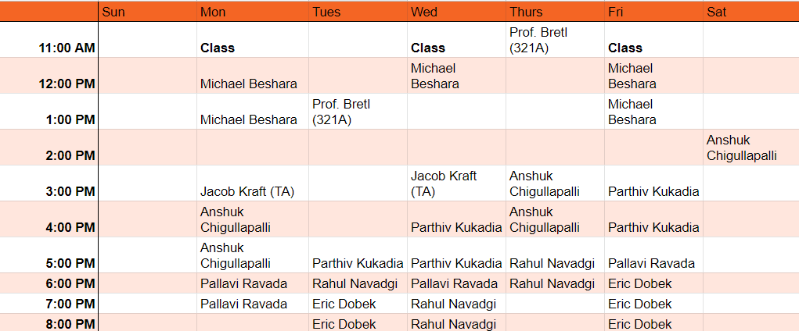

## Contents
{:.no_toc}

* This text will be replaced by a table of contents (excluding the above header) as an unordered list
{:toc}

---

## Instructor

Prof. Timothy Bretl
* Email: <tbretl@illinois.edu>
* Phone: 217-244-3126
* [Website](https://bretl.csl.illinois.edu)
* Office Hours:
    * Tuesdays, 1:00pm-2:00pm CST, in Talbot 321A
    * Thursdays, 11:00am-12:00pm CST, in Talbot 321A
    * [By appointment on Zoom](https://calendly.com/timbretl)

## Teaching Assistant

Mr. Jacob Kraft
* Email: <jacobgk2@illinois.edu>
* Phone: 440-409-1499
* Office Hours:
    * Mondays, 3:00pm-4:00pm CST, in Talbot 321D
    * Wednesdays, 3:00pm-4:00pm CST, in Talbot 321D
    * [By appointment on Zoom](https://calendly.com/jacobgk2)

## Aerolab Schedule

## Time and Place

Lecture will be in-person:
* **Time:** Mondays, Wednesdays, and Fridays from 11:00am-11:50am CST
* **Place:** 4025 Campus Instructional Facility

Synchronous, remote attendance is possible when necessary - for example, during the week of January 17 when all classes are remote, or when you are in quarantine and cannot attend in person - but this option is not preferred:
* Zoom (see [Campuswire](https://campuswire.com/c/GF2D039DE) for link)

Lecture will also be recorded for later review:
* MediaSpace ([view](https://mediaspace.illinois.edu/channel/AE353+%28Spring+2022%29/) or [subscribe](https://mediaspace.illinois.edu/channel/AE353+%28Spring+2022%29/243767652/subscribe))

## Discussion Forum

[Campuswire](https://campuswire.com/c/GF2D039DE) ([ask Prof. Bretl for an invitation](mailto:tbretl@illinois.edu) if you haven't received one yet)

## Course Description

Modeling, analysis, and control of linear dynamic systems.

## Prerequisite

Be an undergraduate student in Aerospace Engineering, with credit or concurrent registration in MATH 225, MATH 285, and TAM 212 (or equivalent). You cannot take this class if you have already taken GE 320 or ME 340.

## Reference Text

The following book is available online for free, as a reference:
* [Feedback Systems: An Introduction for Scientists and Engineers (Astrom and Murray)](https://fbswiki.org/)

There is no required textbook.

## In-Class Activities

You will complete a short activity during (nearly) every lecture using [PrairieLearn](https://www.prairielearn.org/pl/course_instance/129078). For this reason, it is important that you **bring your laptop to class each day** (or some other device that can run PrairieLearn).

## Homework

You will complete a homework assignment after (nearly) every lecture using [PrairieLearn](https://www.prairielearn.org/pl/course_instance/129078).

## Exams

You will take four 50-minute exams during the semester in the [Computer-Based Testing Facility (CBTF)](https://cbtf.engr.illinois.edu). Optionally, you may retake each exam exactly once. If you retake an exam, your score will be computed as follows:

$$
\text{final score} = \frac{9}{10}\left(\text{higher score}\right) + \frac{1}{10}\left(\text{lower score}\right)
$$

The policies of the CBTF are the policies of this course, and academic integrity infractions related to the CBTF are infractions in this course.

If you have accommodations identified by the Division of Rehabilitation-Education Services (DRES) for exams, please email your Letter of Accommodations (LOA) to [cbtf@illinois.edu](mailto:cbtf@illinois.edu) before you make your first exam reservation. This must be done each semester you use the CBTF.

If you have any issue during an exam, inform the proctor immediately. Work with the proctor to resolve the issue at the time before logging off. If you do not inform a proctor of a problem during the test then you forfeit all rights to redress.

If you do not have a physical i-card, and therefore no ID photo with the i-card office, submit a photo to the CBTF as soon as possible to avoid problems when checking in for exams. Email photos to [cbtf@illinois.edu](mailto:cbtf@illinois.edu).

Review all instructions on the [CBTF website](https://cbtf.illinois.edu/students) before your first exam.

## Design Projects

You will complete four design projects in groups of two that require the submission of python code, a short video, and a written report. You may talk with other colleagues about these projects, so long as all materials submitted are those of your own group (see [academic integrity](#academic-integrity)).

## Final Exam

There will be no final exam.

## Grading

Grades will be posted to [canvas](https://canvas.illinois.edu/courses/17243/).

##### Distribution
* 5% in-class activities
* 20% homework
* 35% exams
* 40% design projects

##### Scale
* 97-100 (A+), 93-97 (A), 90-93 (A-), 87-90 (B+), etc.
* No curve will be applied to the grades.

##### Extra Credit

You may be given opportunities to earn extra credit on various assignments. This credit will apply only to the type of assignment for which it was given. For example, you may earn a maximum of 20% for homework, regardless of how much extra credit you receive on homework assignments.

---

## Time Management

You will earn three credit hours for completing this course. The [federal definition of a "credit hour"](https://provost.illinois.edu/policies/policies/courses/credit-hour-definition/) is an amount of work that reasonably approximates not less than one hour of instruction and two hours of out-of-class student work each week throughout the semester. Therefore, each of you should expect to spend about nine hours on this course each week, including the time you spend in lecture. If you are struggling with time management, please **ask one of us for help**.

## Academic Integrity

You are encouraged to talk with all of your colleagues about all of your work this semester, so long as you acknowledge and cite the people with whom you talked. Materials submitted must be your own --- please refer to the [student code](https://studentcode.illinois.edu/) for a definition of [plagiarism](https://studentcode.illinois.edu/article1/part4/1-402/), which is an academic integrity infraction. Academic integrity allegations like plagiarism will be reported using the Faculty Academic Integrity Reporting (FAIR) system. Confirmed infractions may result in a zero grade for the corresponding assignment and, in some cases, a failing grade for the course. If you are unsure of what constitutes plagiarism or any other breach of academic integrity, please **ask one of us for help**.

---

## COVID

[[source]](https://covid19.illinois.edu/on-campus/on-campus-instructors/)

##### General Expectations

Following University policy, all students are required to engage in appropriate behavior to protect the health and safety of the community. Students are also required to follow the campus COVID-19 protocols.

Students who feel ill must not come to class. In addition, students who test positive for COVID-19 or have had an exposure that requires testing and/or quarantine must not attend class. The University will provide information to the instructor, in a manner that complies with privacy laws, about students in these latter categories. These students are judged to have excused absences for the class period and should contact the instructor via email about making up the work.     

Students who fail to abide by these rules will first be asked to comply; if they refuse, they will be required to leave the classroom immediately. If a student is asked to leave the classroom, the non-compliant student will be judged to have an unexcused absence and reported to the Office for Student Conflict Resolution for disciplinary action. Accumulation of non-compliance complaints against a student may result in dismissal from the University.

##### Face Coverings

All students, faculty, staff, and visitors are required to wear face coverings in classrooms and university spaces. This is in accordance with CDC guidance and University policy and expected in this class.

Please refer to the University of Illinois Urbana-Champaign’s COVID-19 website for [further information on face coverings](https://covid19.illinois.edu/health-and-support/face-coverings/). Thank you for respecting all of our well-being so we can learn and interact together productively.

##### Building Access

In order to implement COVID-19-related guidelines and policies affecting university operations, instructional faculty members may ask students in the classroom to show their Building Access Status in the Safer Illinois app or the Boarding Pass. Staff members may ask students in university offices to show their Building Access Status in the Safer Illinois app or the Boarding Pass. If the Building Access Status says "Granted," that means the individual is compliant with the university’s COVID-19 policies --- either with a university-approved COVID-19 vaccine or with the on-campus COVID-19 testing program for unvaccinated students.

Students are required to show only the Building Access Screen, which shows compliance without specifying whether it was through COVID-19 vaccination or regular on-campus testing. To protect personal health information, this screen does not say if a person is vaccinated or not. Students are not required to show anyone the screen that displays their vaccination status. No university official, including faculty members, may ask students why they are not vaccinated or any other questions seeking personal health information.

## Anti-Racism and Inclusivity

[[source]](https://wiki.illinois.edu/wiki/display/ugadvise/Syllabus+Statements)

The Grainger College of Engineering is committed to the creation of an anti-racist, inclusive community that welcomes diversity along a number of dimensions, including, but not limited to, race, ethnicity and national origins, gender and gender identity, sexuality, disability status, class, age, or religious beliefs. The College recognizes that we are learning together in the midst of the Black Lives Matter movement, that Black, Hispanic, and Indigenous voices and contributions have largely either been excluded from, or not recognized in, science and engineering, and that both overt racism and micro-aggressions threaten the well-being of our students and our university community.

The effectiveness of this course is dependent upon each of us to create a safe and encouraging learning environment that allows for the open exchange of ideas while also ensuring equitable opportunities and respect for all of us. Everyone is expected to help establish and maintain an environment where students, staff, and faculty can contribute without fear of personal ridicule, or intolerant or offensive language. If you witness or experience racism, discrimination, micro-aggressions, or other offensive behavior, you are encouraged to bring this to the attention of the course director if you feel comfortable. You can also report these behaviors to the [Bias Assessment and Response Team (BART)](https://bart.illinois.edu/). Based on your report, BART members will follow up and reach out to students to make sure they have the support they need to be healthy and safe. If the reported behavior also violates university policy, staff in the Office for Student Conflict Resolution may respond as well and will take appropriate action.

## Disability-Related Accommodations

[[source]](https://wiki.illinois.edu/wiki/display/ugadvise/Syllabus+Statements)

To obtain disability-related academic adjustments and/or auxiliary aids, students with disabilities must contact the course instructor and the Disability Resources and Educational Services (DRES) as soon as possible. To contact DRES, you may visit 1207 S. Oak St., Champaign, call 333-4603, e-mail [disability@illinois.edu](mailto:disability@illinois.edu) or go to [https://www.disability.illinois.edu](https://www.disability.illinois.edu). If you are concerned you have a disability-related condition that is impacting your academic progress, there are academic screening appointments available that can help diagnosis a previously undiagnosed disability. You may access these by visiting the DRES website and selecting “Request an Academic Screening” at the bottom of the page.

## Family Educational Rights and Privacy Act (FERPA)

[[source]](https://wiki.illinois.edu/wiki/display/ugadvise/Syllabus+Statements)

Any student who has suppressed their directory information pursuant to Family Educational Rights and Privacy Act (FERPA) should self-identify to the instructor to ensure protection of the privacy of their attendance in this course. See [https://registrar.illinois.edu/academic-records/ferpa/](https://registrar.illinois.edu/academic-records/ferpa/) for more information on FERPA.

## Religious Observances

[[source]](https://wiki.illinois.edu/wiki/display/ugadvise/Syllabus+Statements)

Illinois law requires the University to reasonably accommodate its students' religious beliefs, observances, and practices in regard to admissions, class attendance, and the scheduling of examinations and work requirements. You should examine this syllabus at the beginning of the semester for potential conflicts between course deadlines and any of your religious observances. If a conflict exists, you should notify your instructor of the conflict and follow the procedure at [https://odos.illinois.edu/community-of-care/resources/students/religious-observances/](https://odos.illinois.edu/community-of-care/resources/students/religious-observances/) to request appropriate accommodations. This should be done in the first two weeks of classes.

## Emergency Response

[[source]](https://wiki.illinois.edu/wiki/display/ugadvise/Syllabus+Statements)

Emergency response recommendations can be found at the following website: [http://police.illinois.edu/emergency-preparedness/](http://police.illinois.edu/emergency-preparedness/).  I encourage you to review this website and the campus building floor plans website within the first 10 days of class:  [http://police.illinois.edu/emergency-preparedness/building-emergency-action-plans/](http://police.illinois.edu/emergency-preparedness/building-emergency-action-plans/).
