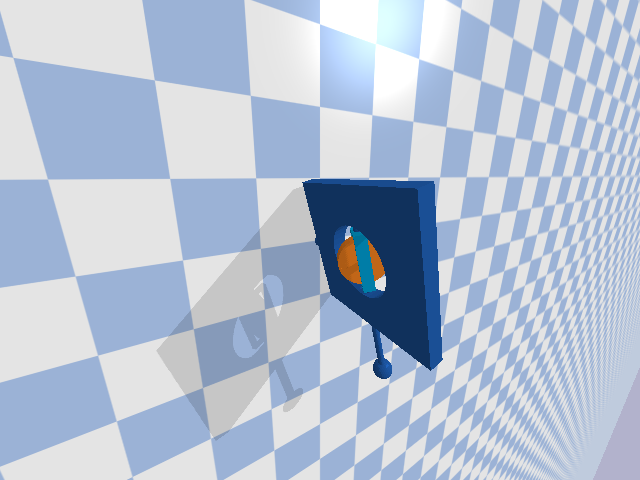

## Contents
{:.no_toc}

* This text will be replaced by a table of contents (excluding the above header) as an unordered list
{:toc}

---

## Design Project \#1 (CMG)

### The system

The first project that you will complete this semester is to design, implement, and test a controller that uses a single-gimbal control moment gyroscope (CMG) to reorient a platform in a gravitational field, as pictured below:

This system has three parts:

* A *platform* (dark blue) that can rotate freely about its base. Think of this as a spacecraft that is confined to rotate about its pitch axis, as if it were being tested on the ground.
* A *gimbal* (light blue) that can be driven by a motor to rotate about a perpendicular axis with respect to the platform.
* A *rotor* (orange) that can be driven by a motor to spin about yet another perpendicular axis with respect to the gimbal.

If the rotor is spun at a high rate, then an "input torque" applied to the gimbal will, through conservation of angular momentum, result in an "output torque" applied to the platform. This output torque can be used, in particular, to change the orientation of the platform.

One advantage of using a single-gimbal CMG over a reaction wheel is that this output torque can be much higher than the input torque --- a so-called "torque amplification" effect. One disadvantage of using a CMG is that the resulting dynamics are more complicated and require a more sophisticated controller.

You can read more about CMGs and their use for spacecraft attitude control in [Fundamentals of Spacecraft Attitude Determination and Control (Markley and Crassidis, 2014)](https://link.springer.com/book/10.1007/978-1-4939-0802-8).

The motion of the system is governed by the following ordinary differential equations:

$$
\begin{aligned}
\ddot{q}_1 &= \dfrac{a_1 \sin(2q_2) \dot{q}_1\dot{q}_2 + a_2\cos(q_2)\dot{q}_2v_\text{rotor} + a_3\sin(q_1)}{a_4 + a_5\cos^2(q_2)} \\[1em]
\ddot{q}_2 &= a_6 \sin(2q_2)\dot{q}_1^2 + a_7\cos(q_2)\dot{q}_1v_\text{rotor} + a_8\tau
\end{aligned}
$$

In these equations, the following variables are functions of time:

* $q_1$ and $\dot{q}_1$ are the angle (rad) and angular velocity (rad/s) of the platform
* $q_2$ and $\dot{q}_2$ are the angle (rad) and angular velocity (rad/s) of the gimbal
* $\tau$ is the torque (N$\cdot$m) applied by the platform to the gimbal

The following variable is also a function of time, although you may assume that it is constant (a low-level controller was designed and implemented for you that tries to ensure this is true):

* $v_\text{rotor} = 1000$ is the angular velocity (rad/s) of the rotor

All other parameters are constant:

$$
\begin{aligned}
a_1 &= - J_{3y} + 2 J_{3z} \\
a_2 &= 2 J_{3y} \\
a_3 &= - 2 g m r \\
a_4 &= 2 J_{1z} + 2 J_{2z} + 2 m r^{2} \\
a_5 &= 2 J_{3z} \\
a_6 &= \frac{J_{3y} - J_{3z}}{2 \left(J_{2x} + J_{3x}\right)} \\
a_7 &= - \frac{J_{3y}}{J_{2x} + J_{3x}} \\
a_8 &= \frac{1}{J_{2x} + J_{3x}}
\end{aligned}
$$

These parameters are defined in terms of the following quantities:

* $J_{1z} = 0.5\;\text{kg}\cdot\text{m}^2$, one principal moment of inertia of the platform
* $J_{2x} = J_{2z} = 0.001\;\text{kg}\cdot\text{m}^2$, two principal moments of inertia of the gimbal
* $J_{3x} = J_{3y} = J_{3z} = 0.01\;\text{kg}\cdot\text{m}^2$, principal moments of inertia of the rotor
* $m = 1.0\;\text{kg}$, the mass of the boom
* $r = 2.0\;\text{m}$, the length of the boom
* $g = 9.81\;\text{m}/\text{s}^2$, the acceleration of gravity

Sensors provide measurements of all angles and angular velocities. Actuators allow you to choose what torque will be applied by the platform to the gimbal, up to a maximum of $\pm 5\;\text{N}\cdot\text{m}$.

The code provided [here]({{ site.github.repository_url }}/tree/main/projects/01_cmg) simulates the motion of this system ([CMGDemo]({{ site.github.repository_url }}/tree/main/projects/01_cmg/CMGDemo-Template.ipynb)) and also derives the equations of motion in symbolic form ([DeriveEOM]({{ site.github.repository_url }}/tree/main/projects/01_cmg/DeriveEOM.ipynb)).

The system starts at whatever initial conditions you choose. The goal is to bring the platform back to rest at some desired angle that you get to choose. Careful! Not all platform angles may be achievable.

### Your tasks

Please do the following things:

* Choose a platform angle that you want to achieve.
* Linearize the model about an equilibrium point that corresponds to this platform angle and express the result in state-space form.
* Design a linear state feedback controller and verify that the closed-loop system is asymptotically stable in theory.
* Implement this controller and verify that the closed-loop system is asymptotically stable in simulation, at least when initial conditions are close to equilibrium.

Remember that your controller is not expected to "work" in all cases and that you should try hard to establish limits of performance (i.e., to break your controller).

For example, it is insufficient to simulate the application of your controller from one set of initial conditions, plot the resulting trajectory, argue that this trajectory is consistent with the closed-loop system being stable, and conclude (wrongly) that your controller "works." Instead, you should test your controller from many different sets of initial conditions and should try to distinguish between conditions that do and do not lead to failure.

An exceptional response to this project would go beyond minimum requirements and consider a variety of other factors that might impact the performance of your controller, such as changing the boom mass $m$ or the rotor velocity $v_\text{rotor}$. (There are many other opportunities --- just let us know what strikes you as interesting.)

### Your deliverables

##### Draft report with theory (by 11:59pm on Friday, February 4)

Submit a first draft of your [report (see below for guidelines)](#final-report-by-1159pm-on-friday-february-18) that includes, at minimum, a complete "Theory" section. This draft must also include the appendix with your log of all work done so far by each group member.

Upload it to the **DP1 Draft 1** assignment on [Gradescope](https://www.gradescope.com/courses/355834). This is a group assignment, so please be sure to [add your partner to your submission](https://help.gradescope.com/article/m5qz2xsnjy-student-add-group-members).

##### Draft report with results (by 11:59pm on Friday, February 11)

Submit a second draft of your [report (see below for guidelines)](#final-report-by-1159pm-on-friday-february-18) that includes, at minimum, a complete "Experimental methods" section and a complete "Results and discussion" section. This draft must also include the appendix with your log of all work done so far by each group member.

Upload it to the **DP1 Draft 2** assignment on [Gradescope](https://www.gradescope.com/courses/355834). This is a group assignment, so please be sure to [add your partner to your submission](https://help.gradescope.com/article/m5qz2xsnjy-student-add-group-members).

##### Final report (by 11:59pm on Friday, February 18)

This report will satisfy the following requirements:

* It must be a single PDF document that conforms to the guidelines for [Preparation of Papers for AIAA Technical Conferences](https://www.aiaa.org/events-learning/events/Technical-Presenter-Resources). In particular, you **must** use either the [Word](https://www.aiaa.org/docs/default-source/uploadedfiles/aiaa-forums-shared-universal-content/preparation-of-papers-for-technical-conferences.docx?sfvrsn=e9a97512_10) or [LaTeX](https://www.overleaf.com/latex/templates/latex-template-for-the-preparation-of-papers-for-aiaa-technical-conferences/rsssbwthkptn#.WbgUXMiGNPZ) manuscript template.
* It must have a descriptive title that begins with "DP1" (e.g., "DP1: CMG control of a spacecraft").
* It must have a list of author names and affiliations.
* It must contain the following sections:
  * *Abstract.* Summarize your entire report in one short paragraph.
  * *Nomenclature.* List all symbols used in your report, with units.
  * *Introduction.* Prepare the reader to understand the rest of your report and how it fits within a broader context.
  * *Theory.* Derive a model and do control design.
  * *Experimental methods.* Describe the experiments you performed in simulation in enough detail that they could be understood and repeated by a colleague.
  * *Results and discussion.* Show the results of your experiments in simulation (e.g., with plots and tables) and discuss the extent to which they validate your control design. Remember to [focus on establishing limits of performance](#your-tasks).
  * *Conclusion.* Summarize key conclusions and identify ways that others could improve or build upon your work.
  * *Acknowledgements.* Thank anyone outside your group with whom you discussed this project and clearly describe what you are thanking them for.
  * *References.* Cite any sources, including the work of your colleagues.
  * *Appendix.* See below.
* It must be a maximum of 6 pages.

The appendix, which does not count against your page limit, must have a table (with as many rows as necessary) that logs all of the work done by each group member on the project:

| Day | Task | Person or People |
| :-: | :-: | :-: |
| | | |
| | | |

 

Submit your report by uploading it to the **DP1 Report** assignment on [Gradescope](https://www.gradescope.com/courses/355834). This is a group assignment, so please be sure to [add your partner to your submission](https://help.gradescope.com/article/m5qz2xsnjy-student-add-group-members).

##### Final video (by 11:59pm on Friday, February 18)

This video will satisfy the following requirements:

* It must be 70 seconds in length.
* The first and last 5 seconds must include text with a descriptive title (the same title as your report), your names, and the following words somewhere in some order:
  * AE353: Aerospace Control Systems
  * Spring 2022
  * Department of Aerospace Engineering
  * University of Illinois at Urbana-Champaign
* The middle 60 seconds must *clearly* communicate what you did, why you did it, how you did it, and what the results were.
* It must show at least one simulation of your working control system.
* It must stay professional (use good sense, please).

Submit your video by uploading it to the [AE353 (Spring 2022) Project Videos](https://mediaspace.illinois.edu/channel/channelid/245771012) channel on Illinois Media Space. Please take care to do the following:

* Use the same descriptive title as your report, appended with your names in parentheses --- for example, "DP1: CMG control of a spacecraft (Tim Bretl and Jacob Kraft)".
* Add the tag `DP1` (an **upper case** "DP" followed by the number "1"), so viewers can filter by project number.

You are welcome to resubmit your video at any time before the deadline. To do so, please "Edit" your **existing** video and then do "Replace Media". Please do **not** create a whole new submission.

We realize that 60 seconds is short! Think carefully about what to include (what to show and what to say) and anticipate the need for multiple "takes" and for time spent editing.

##### Final code (by 11:59pm on Friday, February 18)

This code will satisfy the following requirements:

* It must be a single jupyter notebook (with the extension `.ipynb`) that, if placed in the `projects/01_cmg` directory and run from start to finish, would reproduce *all* of the results that you show in your report.
* It must not rely on any dependencies other than those associated with the [`ae353` conda environment](setup).
* It must be organized and clearly documented, with a mix of markdown cells and inline comments.

Submit your code by uploading it to the **DP1 Code** assignment on [Gradescope](https://www.gradescope.com/courses/355834). This is a group assignment, so please be sure to [add your partner to your submission](https://help.gradescope.com/article/m5qz2xsnjy-student-add-group-members).

### Evaluation

Your project grade will be weighted as follows:

* (10%) Draft report with theory
* (10%) Draft report with results
* (50%) Final report
* (20%) Final video
* (10%) Final code

Rubrics will be discussed in class.

### Frequently asked questions

##### May I watch videos that are submitted by other students?

Yes. All videos will be available in the [AE353 (Spring 2022) Project Videos](https://mediaspace.illinois.edu/channel/channelid/245771012) channel on Illinois Media Space as soon as they are submitted by your colleagues (see the [Video](#final-video-by-1159pm-on-friday-february-18) deliverable). You may watch these videos whenever you want, even before you submit your own.

If you are inspired by a video, or if watching a video strongly influences the way you proceed with your own design project, then you must **acknowledge and cite** this video in your report (and in your own video, if appropriate). Failure to do so would be considered [plagiarism](https://studentcode.illinois.edu/article1/part4/1-402/).

##### How do I get started?

The first thing you should do is [follow the instructions to download and run course code](setup), verify that you can run the simulation, and mess around a little bit with different actuator commands (e.g., constant gimbal torque) to get a sense for how the system responds. You might want to try a PD controller, as we did in class, even before you start doing any analysis.

After that, if you have read the entire [project description](#design-project-1-cmg) and are not sure how to proceed, then take your best guess and ask a question on [Campuswire](https://campuswire.com/c/GF2D039DE). Improving your ability to get unstuck by asking a good question is an explicit goal of this course.

